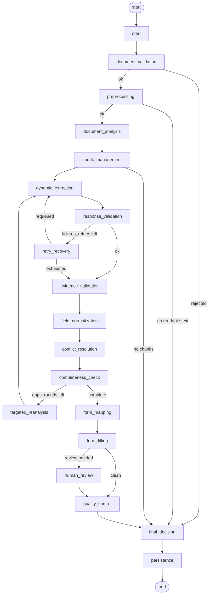

# Agentic Document Processing & Dynamic Form Filling

A multi-agent LangGraph workflow that reads a document of any length, extracts
every field-value pair it can evidence, resolves duplicates and contradictions
without discarding either, maps what survives onto a target form whose shape it
discovers at runtime, and returns an auditable verdict.

Accuracy, completeness and traceability are prioritised over speed throughout.
Where those goals conflict with cost, the resolution is always to spend more and
report honestly rather than to guess.

---

## 1. System architecture

```
                        ┌──────────────────────────────┐
   upload ─────────────►│  FastAPI  /graph/documents   │
                        └───────────────┬──────────────┘
                                        │ background task
                        ┌───────────────▼──────────────┐
                        │      LangGraph workflow      │
                        │  16 nodes, 1 typed state     │
                        └───────┬──────────────┬───────┘
                                │              │
              checkpoint after  │              │  result + audit
              every node        │              │
                        ┌───────▼──────┐  ┌────▼─────────────┐
                        │ checkpoints  │  │  graph_runs +5   │
                        │  (SQLite/PG) │  │  tables (SQLite/PG)│
                        └──────────────┘  └──────────────────┘
```

The central design decision: **eleven of the sixteen nodes contain no LLM call
at all.** Anything decidable by counting pages, comparing strings or checking a
schema is decided in Python. The model is spent only on genuine semantic
judgement — five nodes: structure analysis, extraction, field-name equivalence,
conflict adjudication, and form correspondence.

That split buys three things. Correctness guarantees live in code that can be
unit-tested without a network call (83 tests, all offline). Cost scales with the
document rather than the pipeline. And when something goes wrong, the question
"was this a model problem or a logic problem" has an answer.

### Layers

| Layer | Module | Responsibility |
|---|---|---|
| Orchestration | `app/graph/graph.py` | node wiring, conditional routing, loop guards, checkpointer |
| Entry points | `app/graph/runner.py` | run / stream / resume / status |
| State | `app/graph/state.py` | one Pydantic model threaded through every node |
| Contracts | `app/graph/schemas.py` | every typed structure, including the required output formats |
| Errors | `app/graph/errors.py` | 30-type taxonomy, critical / fatal / retryable classification |
| LLM access | `app/graph/llm.py` | provider chain, rate limiting, structured parsing, attempt escalation |
| Prompts | `app/graph/prompts.py` | all agent prompts in one reviewable place |
| Agents | `app/graph/nodes/*.py` | one module per agent or stage |
| Persistence | `app/graph/database.py` | 6 tables, repository |
| Compatibility | `app/graph/adapter.py` | returns the legacy `PipelineResult` so the existing UI is untouched |
| API | `app/routers/graph_documents.py` | 8 endpoints |

---

## 2. Agent responsibilities

| # | Agent / node | LLM | Responsibility |
|---|---|---|---|
| A | Orchestrator (`graph.py`) | no | routing, retries, escalation, termination |
| B | Document validation | no | file exists, readable, right type, not empty/corrupt/encrypted/oversized |
| C | Preprocessing | no | per-page text, OCR where needed, page metadata, table detection |
| D | Document analysis | **yes** | sections, tables, repeating entities, candidate fields, suspected duplicates |
| E | Chunk management | no | token-safe chunks, page-boundary preservation, coverage audit |
| F | Dynamic extraction | **yes** | every field-value pair, dynamically discovered, with evidence |
| G | Response validation | no | chunk id, page refs, duplicates, truncation, prose-as-field-name |
| H | Retry & recovery | no | split, re-OCR, requeue, backoff, retry ceiling |
| I | Evidence validation | no | every value checked against the actual page text |
| J | Normalisation & merging | **yes** | safe value normalisation; name equivalence with deterministic veto |
| K | Conflict detection & resolution | **yes** | detect deterministically, adjudicate semantically, preserve all |
| L | Completeness | no | page/chunk/evidence coverage, information-loss detection, re-analysis targets |
| M | Dynamic form mapping | **yes** | discover target schema, map by meaning, report confidence and reason |
| N | Form filling | no | fill only verified values, never conflicted, never overwrite better |
| O | Quality control | no | re-derive every claim; separate critical from advisory |
| P | Final decision | no | exactly one of six statuses, with reasoning |
| — | Persistence | no | write the run; never fail the workflow for a DB error |

---

## 3. Workflow diagram

Machine-generated from the compiled graph — `docs/graph_workflow.mmd`, or
`GET /graph/diagram`.



### Loop guards

Three, deliberately independent so one cannot mask another's runaway:

| Guard | Bounds | Default |
|---|---|---|
| `extraction_attempts` | extract → validate → recover cycle | 3 rounds |
| `reanalysis_count` | completeness → re-analyse → extract cycle | 2 rounds |
| `ChunkRecord.attempt_count` | work on any single chunk, **shared across both loops** | 3 attempts |

The third is what stops a chunk ping-ponging between the two loops forever.
A LangGraph `recursion_limit` of 120 is the backstop for a routing bug that
escapes all three; it fails loudly rather than running forever.

Every routing decision reads only state — no clock, no randomness — so a
replayed checkpoint takes the path it took the first time.

---

## 4. Shared state

`app/graph/state.py`. Two rules govern it:

1. **Nothing a reviewer might need is overwritten.** Normalisation *adds*
   `normalized_value` beside `value`; merging records a `MergeRecord` rather
   than deleting occurrences; conflict resolution marks a preference and keeps
   every candidate. Only derived summaries (the reports) are replaced, and they
   are recomputed from scratch each time.
2. **Nodes return partial updates; they never mutate.** List fields that several
   nodes append to carry an `operator.add` reducer.

All fields required by the spec are present: `document_id`, `file_path`,
`file_type`, `document_type`, `total_pages`, `processed_pages`,
`unreadable_pages`, `ocr_pages`, `page_text`, `page_metadata`,
`document_structure`, `chunks`, `processed_chunks`, `failed_chunks`,
`retry_count`, `extracted_fields`, `normalized_fields`, `duplicate_fields`,
`conflicts`, `evidence_validation_results`, `completeness_report`,
`target_form_schema`, `form_mappings`, `filled_form`, `manual_review_items`,
`quality_control_report`, `audit_log`, `metrics`, `current_node`,
`current_status`, `final_status`, `error_details`.

---

## 5. Conditional routing

| From | Router | Branches |
|---|---|---|
| `document_validation` | `route_after_validation` | rejected → decision; else preprocessing |
| `preprocessing` | `route_after_preprocess` | no readable page → decision; else analysis |
| `chunk_management` | `route_after_chunking` | no chunks → decision; else extraction |
| `response_validation` | `route_after_response_validation` | retryable failures **and** budget → recovery; else evidence |
| `retry_recovery` | `route_after_recovery` | anything requeued → extraction; else evidence |
| `completeness_check` | `route_after_completeness` | targets **and** rounds left → re-analysis; else mapping |
| `form_filling` | `route_after_form_filling` | review items and interrupts enabled → human review; else QC |

A validation gate never routes forward on failure — that is the "prevent the
graph from moving forward when required validation fails" requirement, enforced
structurally rather than by convention.

---

## 6. Retry and recovery

Recovery changes something concrete before the next attempt. Re-sending an
identical prompt to a provider that just failed on it is the least likely thing
to work.

| Cause | Action |
|---|---|
| truncated / oversized | split the chunk in half, requeue both, page claims preserved |
| invalid JSON / schema mismatch | LLM layer already escalates to a stricter instruction |
| rate limit / timeout | requeue unchanged; let exponential backoff with jitter run |
| poor text quality / OCR failure | re-OCR the chunk's pages at up to 2× DPI, rebuild, requeue |
| attempts exhausted | abandon, record `RETRY_LIMIT_EXCEEDED`, report as a failed chunk |

Backoff doubles from 2 s to a 60 s cap, with jitter — without jitter, N chunks
that fail together retry together and reproduce the burst that caused the
rate limit.

---

## 7. Checkpointing and resumability

State is checkpointed after **every** node. The `thread_id` is the document id,
so resumability needs no extra bookkeeping:

```python
run_document(path, document_id="doc-123")      # crashes at chunk 41 of 80
resume_document("doc-123")                      # continues from chunk 41
```

Chunks already `PROCESSED` are skipped on re-entry, which is what makes partial
failure recoverable without reprocessing — and what makes targeted re-analysis
possible rather than a full re-run.

`build_checkpointer()` in `graph.py` is the single place that knows which
backend is in use. Set `GRAPH_DATABASE_URL` to a `postgresql://` URL and install
`langgraph-checkpoint-postgres`; nothing else changes.

---

## 8. Human review

Two modes, set by `INTERRUPT_FOR_HUMAN_REVIEW`:

- **off (default)** — review items are recorded, the run completes with
  `MANUAL_REVIEW_REQUIRED`, and a person works the queue afterwards.
- **on** — the graph *interrupts before* `human_review` and the checkpoint
  holds everything. `POST /graph/documents/{id}/review` supplies decisions and
  resumes.

A decision names a `field_uid` — one of the candidates the document actually
contains. There is deliberately **no API path that injects an arbitrary value**,
because that would be a hole straight through the evidence guarantee.

---

## 9. Database schema

| Table | Holds |
|---|---|
| `graph_runs` | one row per run: file, counts, status, metrics, full result JSON |
| `graph_fields` | one row per extracted **occurrence** — not per field name |
| `graph_mappings` | every target field, including the ones nothing mapped to |
| `graph_conflicts` | resolution plus every candidate as JSON |
| `graph_errors` | the spec-section-9 record: type, node, page/chunk, retries, recovery, resolution |
| `graph_audit` | every node event, timestamped |

`graph_fields` is per-occurrence because "how many times did this document state
a serial number, and where" is the question an auditor actually asks. There is
no `ON DELETE CASCADE`: this is an audit store, and records should outlive the
process that made them.

---

## 10. API

| Method | Path | Purpose |
|---|---|---|
| POST | `/graph/documents` | upload, returns `document_id`, processes in background |
| GET | `/graph/documents/{id}/status` | live progress from the checkpoint (cheap to poll) |
| GET | `/graph/documents/{id}/result` | full spec-section-8 payload |
| GET | `/graph/documents` | list runs, filterable by status |
| GET | `/graph/documents/{id}/review` | the human-review queue with evidence |
| POST | `/graph/documents/{id}/review` | submit decisions, resume |
| POST | `/graph/documents/{id}/retry` | resume a crashed run |
| DELETE | `/graph/documents/{id}` | delete the upload; audit record retained |
| GET | `/graph/diagram` | the compiled graph as mermaid |
| GET | `/graph/health` | config + database; `?check_llm=true` probes providers |

Status comes from the checkpointer, results from the database — a run in flight
has no database row, and a finished run should not need the graph rebuilt to be
read.

---

## 11. Folder structure

```
backend/
  app/
    graph/
      __init__.py          public surface
      config.py            GraphSettings, all env-overridable
      state.py             GraphState
      schemas.py           every typed contract
      errors.py            taxonomy + classification
      llm.py               provider chain, rate limiter, structured calls
      prompts.py           all agent prompts
      graph.py             wiring, routers, checkpointer
      runner.py            run / stream / resume / status
      database.py          SQLAlchemy models + repository
      adapter.py           legacy PipelineResult compatibility
      nodes/
        helpers.py         audit, normalisation, field identity
        validation.py      B      preprocess.py    C
        analysis.py        D      chunking.py      E
        extraction.py      F      response_validation.py  G
        recovery.py        H      evidence.py      I
        normalize.py       J      conflicts.py     K
        completeness.py    L      mapping.py       M
        form_fill.py       N      quality.py       O
        decision.py        P      persistence.py
    routers/graph_documents.py
  scripts/graph_sample_run.py
  tests/graph/
    conftest.py  test_nodes_unit.py  test_integration.py  test_failures.py
  Dockerfile
docs/
  GRAPH_ARCHITECTURE.md  GRAPH_DEPLOYMENT.md  graph_workflow.mmd
  samples/sample_milk_report.pdf  samples/sample_output.json
docker-compose.yml
```

---

## 12. Testing

83 graph tests, all offline (every LLM call scripted).

| File | Count | Covers |
|---|---|---|
| `test_nodes_unit.py` | 50 | each deterministic node in isolation |
| `test_integration.py` | 10 | full runs, output contract, resumability, human-in-the-loop |
| `test_failures.py` | 23 | every failure class in spec section 9 |

Notable assertions:

- a page missing from every chunk is a **critical** completeness failure
- an invented value never reaches the filled form
- a hallucinated value is **kept and flagged**, never deleted
- repeated table rows survive deduplication; identical duplicate replies do not
- a conflict resolved on confidence alone is downgraded to manual review
- a database failure does not lose the result
- persistent LLM failure terminates rather than looping

```bash
pytest tests/graph -q                       # 83 passed
pytest -q --ignore=tests/test_benchmark.py  # 285 passed (with existing suite)
```

---

## 13. Two bugs this build found in itself

Worth recording, because both were found by generating the sample rather than by
the test suite — a reminder that a passing suite is not the same as a working
system.

1. **`clean_text()` collapsed newlines.** It folded all whitespace, turning each
   page into a single line and destroying the line structure that table reading,
   label-value association and human-checkable evidence quotes all depend on.
   Fixed to collapse horizontal whitespace only.
2. **The minimum-evidence-length check ran on the wrong string.** It measured the
   alphanumeric-only match form, so `Fat: 4.2 %` became `fat42` — five
   characters — and a perfectly good quote was rejected as "too short to be
   evidential". That silently invalidated most short labelled numeric fields,
   which is most of a lab report. Fixed to measure the cleaned quote.

---

## 14. How information loss is prevented

Nine mechanisms, each closing a specific way data can vanish:

1. **Every page gets a record.** Preprocessing creates a `PageRecord` for every
   page including blank and unreadable ones. Completeness counts records against
   `total_pages`, so an omitted page would look like a page that never existed —
   which is exactly the failure being guarded against.
2. **Every page lands in a chunk.** Empty pages get their own zero-content chunk
   marked `SKIPPED_EMPTY` — accounted for, no call spent. Oversized pages are
   split, never dropped. Chunking then audits its own coverage and raises
   `PAGE_NOT_CHUNKED` if it failed.
3. **Chunking never merges past the size limit.** The binding constraint is
   output tokens: an over-large chunk produces truncated JSON, and truncated
   JSON loses the *whole chunk's* fields, not just the overflow. If a document
   needs eighty chunks it gets eighty chunks.
4. **Repeated occurrences are distinct.** Field identity is
   (name, page, chunk, occurrence, value, evidence) — not name. Twelve equipment
   rows are twelve fields.
5. **Rejected values are kept.** A hallucinated or unsupported value is
   downgraded and flagged, never deleted, so a reviewer can see what was
   rejected and why.
6. **Merging is additive and vetoable.** A merge rewrites the canonical name and
   records a `MergeRecord`; every original name, page and quote survives.
   Deterministic vetoes block merges whose members disagree on data type, or
   come from different sections with different values.
7. **Conflicts preserve every candidate.** Resolution picks a preference. QC
   raises a critical issue if any conflict has fewer than two candidates
   recorded.
8. **Failures are reported, never swallowed.** A failed chunk appears in
   `failed_chunks` and in the final reasoning; an exhausted budget records a
   `stop_reason`; a partial failure keeps every other chunk's fields.
9. **QC re-derives rather than trusts.** It recomputes page and chunk coverage
   from the state instead of reading the flags earlier nodes set, and blocks a
   successful verdict on any value in the form that no extracted field supplies.

---

## 15. Security and privacy

- **Uploads are streamed to disk with a size cap enforced during the write**, so
  an oversized file cannot exhaust memory before being rejected.
- **Extension allow-list, then content verification.** A `.pdf` without a `%PDF`
  header is rejected as corrupt; a `.docx` that is not a zip likewise.
- **Password-protected PDFs are refused, not cracked.**
- **The container runs as UID 10001**, owning only its storage directories.
- **No document content is logged.** Log lines carry ids, counts and error
  types. Evidence quotes live in the database, not in stdout.
- **`DELETE /graph/documents/{id}` removes the source file and keeps the audit
  record** — deliberately, since the audit trail is the compliance artifact.
- **Credentials never enter the state.** Nova uses the ambient AWS chain; API
  keys are read from settings at call time and never serialised into a
  checkpoint.
- **Retention is a deployment decision.** Checkpoints hold full page text.
  For sensitive corpora, prune them after completion — the result row is
  self-contained.
- **PII note.** These documents routinely contain patient and staff names.
  `graph_fields.value` and `exact_source_evidence` hold them in clear. On
  Postgres, use column encryption or a restricted role for those two columns.

---

## 16. Performance and cost

| Lever | Setting | Default | Effect |
|---|---|---|---|
| Chunk size | `MAX_CHUNK_CHARS` | 24000 | fewer, larger calls — watch output truncation |
| Concurrency | `MAX_CONCURRENT_LLM_CALLS` | 4 | wall-clock on long documents |
| Rate limit | `MAX_REQUESTS_PER_MINUTE` | 60 | stays under the provider allowance |
| Retry ceiling | `MAX_ATTEMPTS_PER_CHUNK` | 3 | bounds worst-case spend per chunk |
| Re-analysis | `MAX_REANALYSIS_ROUNDS` | 2 | bounds the completeness loop |
| OCR DPI | `OCR_DPI` | 200 | quality vs memory and time |

Cost scales linearly with pages, not quadratically: one extraction call per
chunk, plus one analysis call, plus at most one merge, one conflict and one
mapping call per document. A 300-page document is roughly
`ceil(300 pages / ~8 pages per chunk) + 4 ≈ 42` calls.

Free savings already built in: four of seven mid-pipeline stages need no model;
the mapping node settles exact name matches deterministically before asking;
empty pages never reach a call; and re-analysis targets only the chunks
completeness nominated.

Cheapest meaningful knob is `MAX_CHUNK_CHARS`. Raising it cuts call count
proportionally, at rising risk of truncated replies — and a truncated reply
costs the whole chunk. Measure before raising it past ~32000.

---

## 17. Observability

- **Audit log**: every node emits entries with node, event, detail, page/chunk
  and level. Persisted to `graph_audit` and returned in the result.
- **Metrics**: per-call latency, tokens, provider, attempt number, attributed to
  the node that spent them. Totals in `metrics.token_usage`.
- **Error records**: type, message, node, page/chunk, retry count, recovery
  action, resolution status — the full spec-section-9 shape.
- **Progress**: `GET /graph/documents/{id}/status` reads the checkpoint without
  re-executing anything.
- **Diagram**: `GET /graph/diagram` returns the compiled graph, so what you
  debug is what is actually running.

---

## 18. Known limitations

State them plainly rather than discovering them in production:

- **No bounding boxes.** The graph works from page text, so a field carries a
  page number but no rectangle. The review UI degrades to a page-level
  highlight. Adding boxes means threading PyMuPDF span geometry through
  chunking and matching evidence back to spans.
- **Nova is unverified end to end.** At the time of writing, Bedrock returns
  `ValidationException: Operation not allowed` for every model on the configured
  AWS account — an account-level entitlement problem, not a code issue. The
  chain defaults to `nova,gemini`, so the workflow runs on Gemini today and will
  use Nova the moment entitlement lands. **No production accuracy figure exists
  for this pipeline yet.**
- **DOCX pagination is synthetic.** No page concept exists, so it is chunked at
  3000 characters per synthetic page. Page numbers are positional, not real.
- **The semantic merge pass is skipped above 250 distinct field names.** Exact
  matching still applies; very wide documents get less merging.
- **Conflict adjudication is capped at 40 conflicts per document.** Beyond that
  the remainder go straight to manual review rather than being guessed at.
